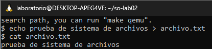
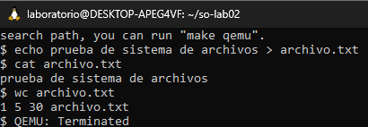
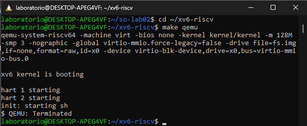
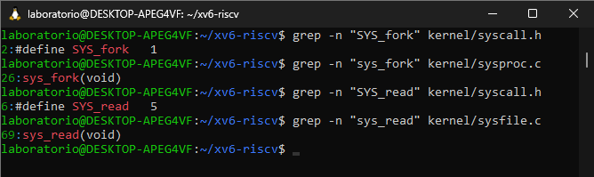

# Laboratorio 02: Instalación y prueba de xv6

## Parte A: Ejecución de comandos en xv6

Llamada al comando ls para ver las carpetas existentes:

Impresión de texto y validación de datos del estudiante:

Creación de directorio nuevo y verificación en el sistema:

Lectura del archivo de texto README incluido en el sistema:

Redirección de texto para creación de archivo nuevo y lectura de verificación:

Conteo de líneas y palabras del archivo, finalizando con el cierre de QEMU:

## Parte B: Ejecución de xv6 y QEMU

Arranque y funcionamiento del sistema operativo xv6 en el entorno QEMU:

## Parte C: Interfaz e implementación de llamadas al sistema

Resultados de búsqueda con grep para la llamada `fork`:
* Interfaz: `kernel/syscall.h:2:#define SYS_fork 1`
* Implementación: `kernel/sysproc.c:26:sys_fork(void)`

Resultados de búsqueda con grep para la llamada `read`:
* Interfaz: `kernel/syscall.h:6:#define SYS_read 5`
* Implementación: `kernel/sysfile.c:69:sys_read(void)`

## Parte D: Reflexión

**¿Qué diferencia se observa entre la interfaz de una llamada al sistema y su implementación interna?**

La interfaz (ubicada en los archivos de cabecera `.h`) opera únicamente como un identificador numérico o firma que expone y registra el servicio disponible para los programas de usuario. En contraste, la implementación (ubicada en los archivos de código fuente `.c`) contiene la lógica algorítmica completa, el manejo de estructuras y las instrucciones reales que el núcleo del sistema operativo ejecuta en el procesador.
