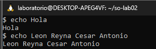
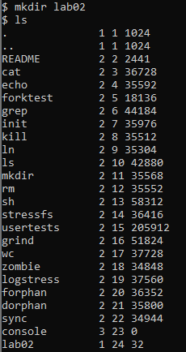
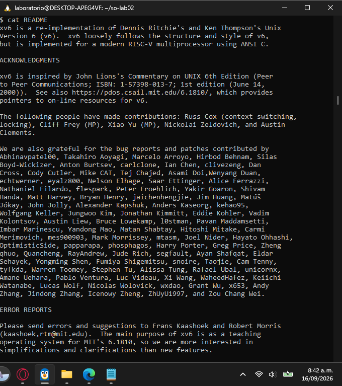

# Laboratorio 02: Instalación y prueba de xv6

## Parte A: Ejecución de comandos en xv6

Llamada al comando ls para ver las carpetas existentes:

Impresión de texto y validación de datos del estudiante:

Creación de directorio nuevo y verificación en el sistema:

Lectura del archivo de texto README incluido en el sistema:

